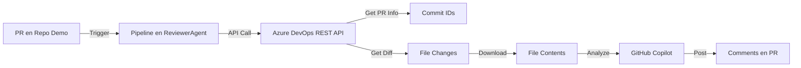

# 🔄 Configuración para Analizar PRs de Múltiples Repositorios

## 📋 Objetivo

Esta pipeline puede analizar Pull Requests de **cualquier repositorio** dentro del mismo proyecto de Azure DevOps, no solo del repositorio donde está definida la pipeline.

## 🏗️ Arquitectura

### Cómo Funciona

1. **Pipeline Centralizada**: La pipeline está en el repositorio `ReviewerAgent`
2. **Análisis via API**: Usa la Azure DevOps REST API para obtener el código de cualquier repositorio
3. **Sin Checkout del Repo Origen**: No necesita hacer `git clone` del repositorio de la PR
4. **Autenticación**: Usa `System.AccessToken` o `AZURE_DEVOPS_EXT_PAT`

### Flujo de Ejecución



### Variables Clave de Azure DevOps

La pipeline usa estas variables automáticas:

| Variable | Descripción | Ejemplo |
|----------|-------------|---------|
| `Build.Repository.ID` | ID del repo donde se ejecuta la PR | `abc-123-def` |
| `Build.Repository.Name` | Nombre del repo | `Demo` |
| `System.PullRequest.PullRequestId` | ID de la PR | `123` |
| `System.PullRequest.SourceBranch` | Rama origen | `refs/heads/feature/new-feature` |
| `System.PullRequest.TargetBranch` | Rama destino | `refs/heads/main` |
| `System.TeamProject` | Proyecto de Azure DevOps | `MyProject` |
| `System.CollectionUri` | URL de la organización | `https://dev.azure.com/myorg/` |

## ⚙️ Configuración Paso a Paso

### 1. Configurar la Pipeline como Servicio de Validación

Para que la pipeline en `ReviewerAgent` se ejecute en PRs de otros repos (como `Demo`):

#### Opción A: Via UI de Azure DevOps

1. Ve al repositorio que quieres revisar (ej: `Demo`)
2. **Settings** → **Repositories** → **Policies** → **Branch Policies**
3. Selecciona la rama (ej: `main`)
4. En "Build Validation", haz clic en **+**
5. Configura:
   ```
   Build pipeline: ReviewerAgent/azure-pipelines.yml
   Display name: Copilot PR Review
   Trigger: Automatic
   Policy requirement: Required (o Optional)
   Build expiration: Immediately
   ```
6. Guarda

#### Opción B: Via YAML (Resources)

Agrega al `azure-pipelines.yml`:

```yaml
resources:
  repositories:
    - repository: Demo
      type: git
      name: MyProject/Demo  # Proyecto/Repositorio
    - repository: OtroRepo
      type: git
      name: MyProject/OtroRepo

trigger: none

# IMPORTANTE: No uses 'pr:' aquí, se configurará via Branch Policies
```

### 2. Configurar Permisos

#### A. Permisos del System.AccessToken

El `System.AccessToken` necesita permisos para:
- ✅ Leer información de PRs de otros repositorios
- ✅ Crear comentarios en PRs de otros repositorios

**Configuración:**

1. Ve a **Project Settings** → **Repositories**
2. Para cada repositorio (Demo, OtroRepo, etc.):
   - **Security** tab
   - Busca: `[Project Name] Build Service ([Organization Name])`
   - Otorga permisos:
     - ✅ **Read** (Code)
     - ✅ **Contribute to pull requests**
     - ✅ **Create tag**

#### B. Usar PAT en lugar de System.AccessToken (Recomendado)

Si tienes problemas con permisos del System.AccessToken:

1. Crea un PAT con scopes:
   - ✅ **Code (Read)**
   - ✅ **Code (Write)** - para crear comentarios

2. Agrégalo al Variable Group "GitHub Copilot CLI":
   ```
   Name: AZURE_DEVOPS_EXT_PAT
   Value: [tu-pat-aquí]
   Type: Secret ✅
   ```

3. La pipeline intentará usar `AZURE_DEVOPS_EXT_PAT` si `System.AccessToken` no funciona

### 3. Configurar Variable Group

Asegúrate de que el Variable Group "GitHub Copilot CLI" tenga:

```
GITHUB_TOKEN=ghp_xxxxx (Secret)
AZURE_DEVOPS_EXT_PAT=xxxxx (Secret) [Opcional pero recomendado]
```

## 🧪 Probar la Configuración

### Test 1: Crear una PR en Demo

1. En el repositorio `Demo`, crea una branch:
   ```bash
   git checkout -b test/copilot-review
   echo "console.log('test');" > test.js
   git add test.js
   git commit -m "Test Copilot review"
   git push origin test/copilot-review
   ```

2. Crea una PR en Azure DevOps: `test/copilot-review` → `main`

3. La pipeline `ReviewerAgent/azure-pipelines.yml` debería ejecutarse automáticamente

4. Verifica en los logs:
   ```
   📋 PR and Repository Information:
     - Build Repository: Demo
     - Build Repository ID: [demo-repo-id]
     - PR #: 123
   ```

### Test 2: Verificar Análisis

Busca en los logs:

```
✅ Found X changed files
📄 Attempting to get file contents and diffs...
  Processing: test.js
🤖 Running Copilot analysis...
✅ Analysis completed successfully
```

### Test 3: Verificar Comentarios

Los comentarios deberían aparecer en la PR con:
- 📊 Resumen del análisis
- 💬 Recomendaciones individuales por archivo

## 🔍 Troubleshooting

### Error: "401 Unauthorized"

**Causa:** System.AccessToken no tiene permisos

**Solución:**
1. Verifica permisos del Build Service (ver sección 2.A)
2. O usa PAT (ver sección 2.B)

### Error: "Could not get PR iterations"

**Causa:** El repositorio de la PR no es accesible

**Solución:**
- Verifica que `Build.Repository.ID` apunta al repo correcto
- Revisa logs: "Build Repository: ..." debería ser `Demo`, no `ReviewerAgent`

### La pipeline no se ejecuta en PRs de Demo

**Causa:** No está configurada como Build Validation

**Solución:**
- Sigue el paso 1 (Configurar como Servicio de Validación)
- Asegúrate de aplicar a las branch policies correctas

### Error: "jq: command not found"

**Causa:** jq no está instalado (ya debería instalarse automáticamente)

**Solución:**
- Verifica que el paso "Install jq" se ejecutó correctamente
- Puede tardar algunos segundos en `apt-get install`

## 📊 Variables del Repositorio Analizado

El script `analyze-changes-full-diff.sh` detecta automáticamente:

```bash
# Estas variables apuntan al repo de la PR (Demo), no al repo de la pipeline (ReviewerAgent)
BUILD_REPOSITORY_ID       # ID de Demo
BUILD_REPOSITORY_NAME     # "Demo"
SYSTEM_PULLREQUEST_*      # Información de la PR en Demo
```

**Importante:** Azure DevOps automáticamente ajusta estas variables para apuntar al repositorio donde se creó la PR, no donde está definida la pipeline.

## 🎯 Ventajas de Esta Arquitectura

1. ✅ **Una sola pipeline** para revisar múltiples repositorios
2. ✅ **Sin duplicar código** de scripts en cada repo
3. ✅ **Funciona con forks y otros repos** del mismo proyecto
4. ✅ **No requiere checkout** del código fuente (más rápido)
5. ✅ **Análisis completo** del diff via API
6. ✅ **Centralizado y mantenible**

## 📝 Limitaciones

1. **Tamaño de archivos**: El script limita a 500 líneas por archivo para evitar timeouts
2. **Cantidad de archivos**: Analiza los primeros 20 archivos (configurable con `MAX_FILES`)
3. **Mismo proyecto**: Solo funciona dentro del mismo proyecto de Azure DevOps
4. **Binarios**: No analiza archivos binarios (imágenes, PDFs, etc.)

## 🔄 Próximos Pasos

1. Configurar Build Validation en cada repo que quieras revisar
2. Probar con una PR de prueba
3. Ajustar `MAX_FILES` y límites de líneas según tus necesidades
4. Revisar los comentarios generados y ajustar el prompt de Copilot si es necesario

---

✅ **Una vez configurado correctamente:**
- Cada PR en cualquier repo configurado ejecutará la revisión automáticamente
- Los comentarios aparecerán en la PR sin intervención manual
- Todo centralizado en la pipeline de ReviewerAgent
